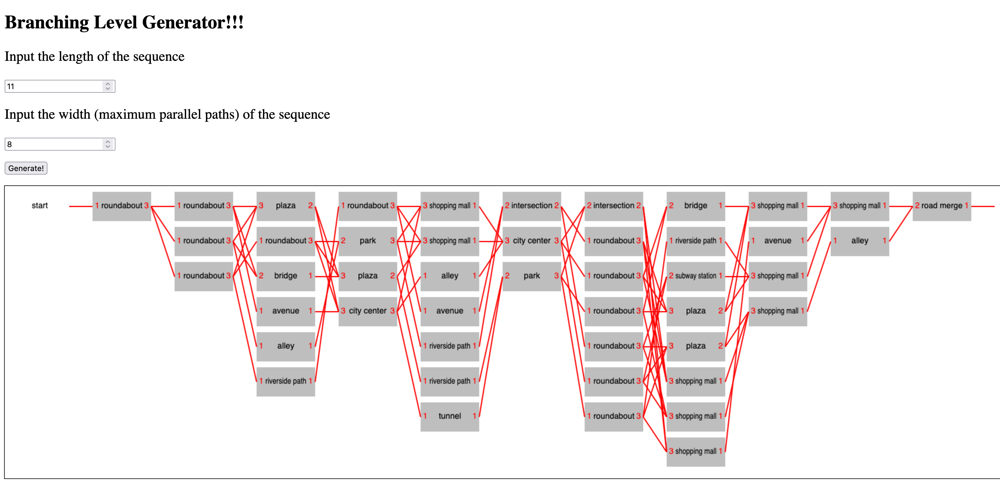
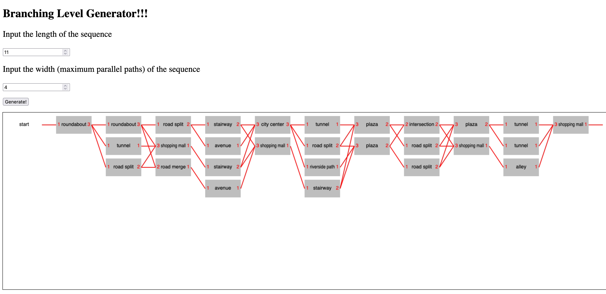
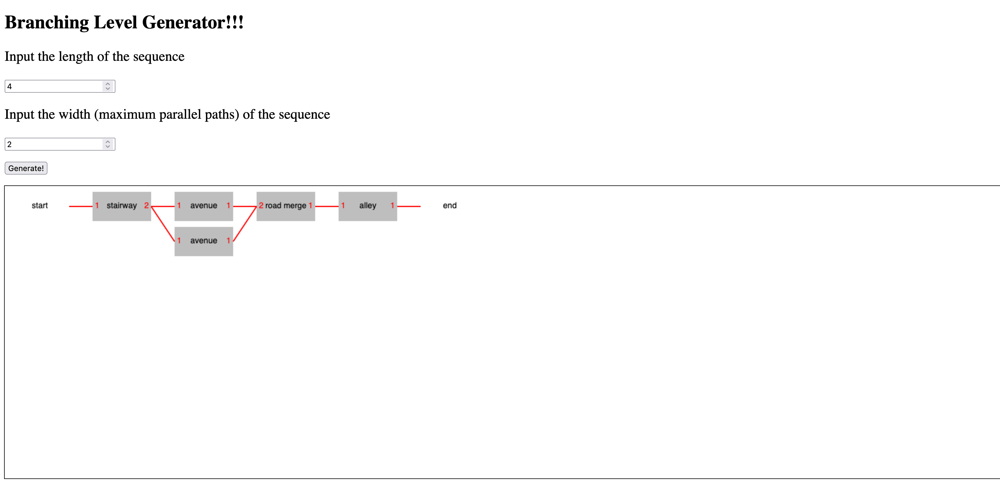
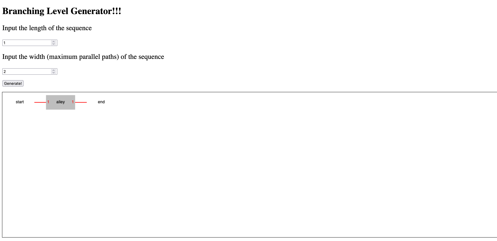
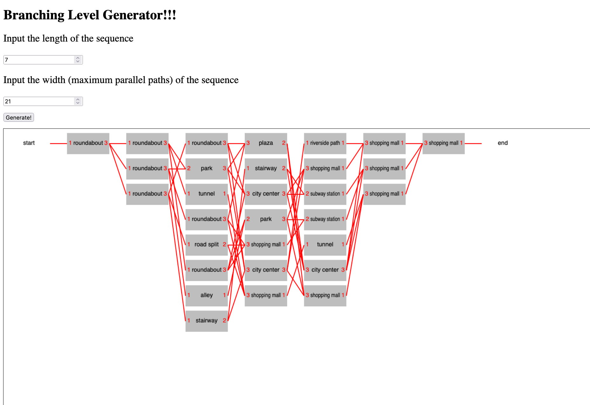

# Branching Level Generator
By Tate Maguire

For CMPM 147 at UCSC

## About
This generator can be accessed [here](https://tatemaguire.github.io/BranchingLevelGenerator/)

# Output Evidence

# Reflection
I think that restricting generation by having very distinct rules and thematic named rooms helped create an easy to understand level. Nodes of the same name have the same in & out counts, which would let the player be familiar with how each room works. It's also a lot more interesting to have a long level with a smaller width, because that creates multiple parallel paths that are easier for players to parse.